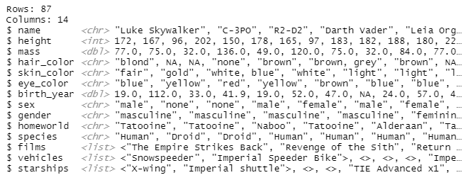
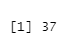
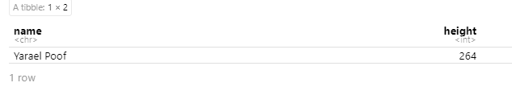
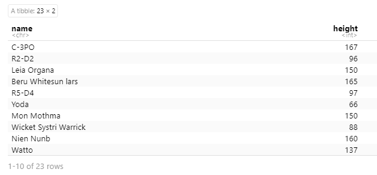
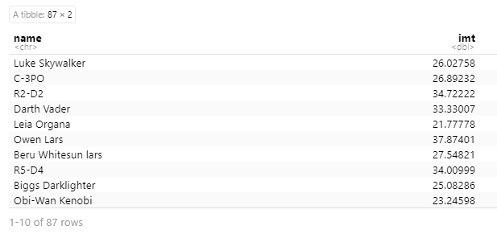
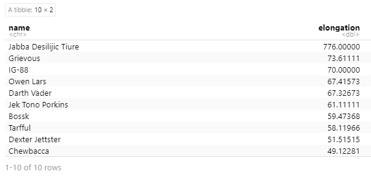
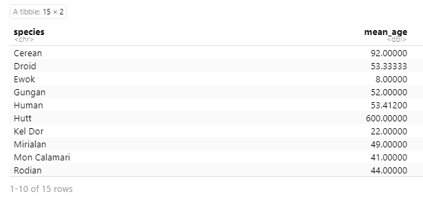
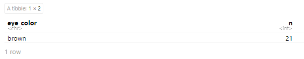

# **Основы обработки данных с помощью R**

### Цель работы

1.  Развить практические навыки использования языка программирования R для обработки данных

2.  Закрепить знания базовых типов данных языка R

3.  Развить пркатические навыки использования функций обработки данных пакета dplyr -- функции select(), filter(), mutate(), arrange(), group_by()

### Исходные данные

1.  Программное обеспечение Windows 10 Pro

2.  Rstudio Desktop

3.  Интерпретатор языка R 4.2.1

4.  Практическое задание №3

### План

Проанализировать встроенный в пакет *dplyr* набор данных *starwars* с помощью языка R и ответить на вопросы из файла.

### Шаги

1.  Импортируем встроенный пакет dplyr и набор данных starwars:

```{r}
library(dplyr)
starwars <- starwars
```

2.  Сколько строк в датафрейме?

```{r}
starwars %>% ncol()
```


3.  Как просмотреть примерный вид датафрейма?

```{r}
starwars %>% glimpse()
```



4.  Сколько уникальных рас персонажей(species) представлено в данных?

```{r}
species <- starwars["species"]
length(unique(species[!is.na(species)]))
```



5.  Найти самого высокого персонажа

```{r}
starwars %>%
  arrange(desc(height)) %>%
  head(1) %>%
  select(name,height)
```



6.  Найти всех персонажей ниже 170

```{r}
starwars %>%
  filter(height < 170) %>%
  select(name,height)
```



7.  Подсчитать ИМТ (индекс массы тела) для всех персонажей. ИМТ подсчитать по формуле I = m/h\^2, где m - масса (weight), а h - рост (height)

```{r}
starwars %>%
  mutate(imt = mass / ((height*0.01) ^ 2)) %>%
  select(name,imt)
```



8.  Найти 10 самых "вытянутых" персонажей. "Вытянутость" оценить по отношению массы (mass) к росту (height) персонажей

```{r}
starwars %>%
  mutate(elongation = mass/(height*0.01)) %>%
  arrange(desc(elongation)) %>%
  head(10) %>%
  select(name,elongation)
```



9.  Найти средний возраст персонажей каждой расы вселенной Звездных войн

```{r}
starwars %>%
  filter(!(birth_year %in% NA)) %>% 
  filter(!(species %in% NA)) %>%
  group_by(species) %>%
  summarise(mean_age = mean(birth_year))
```



10. Найти самый распространенный цвет глаз персонажей вселенной Звездных войн

```{r}
starwars %>%
  filter(!(eye_color %in% NA)) %>%
  count(eye_color, sort = TRUE) %>%
  head(1)
```



11. Подсчитать среднюю длину имени в каждой расе вселенной Звездных войн

```{r}
starwars %>%
  filter(!(species %in% NA)) %>%
  group_by(species) %>%
  summarise(mean_len_name = mean(nchar(name)))
```


### Оценка результата

В результате практической работы ответил на все поставленные вопросы.

### Вывод

Таким образом, я проанализировал встроенный в пакет dplyr набор данных starwars и ответил на все вопросы.
